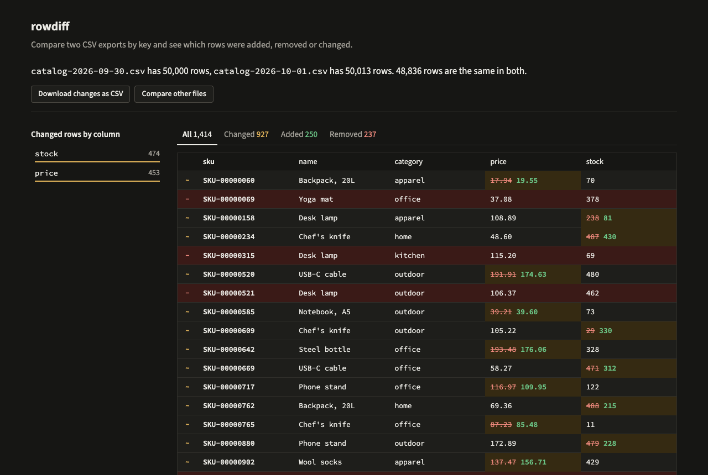

# rowdiff

Compare two CSV exports by a key column and see which rows were added, removed
or changed, and in which columns. Row order doesn't matter, column order
doesn't matter, and the files can be bigger than your RAM.

The usual way to answer "what changed in the catalog since yesterday?" is a
spreadsheet VLOOKUP that falls over past a few hundred thousand rows, or a
line diff that reports every row as changed because the export came out in a
different order. rowdiff matches rows by key instead of by position.

```
$ rowdiff catalog-2026-09-30.csv catalog-2026-10-01.csv -k sku
catalog-2026-09-30.csv  50000 rows
catalog-2026-10-01.csv  50013 rows

added      250
removed    237
changed    927
unchanged  48836

changed rows by column
  stock     474
  price     453

~ SKU-00000060  price: "17.94" -> "19.55"
- SKU-00000069
~ SKU-00000158  stock: "238" -> "81"
... and 1411 more. Raise --limit to see them.
```

There is also a small web app for the same job: drop in two files, pick the
key, and page through the differences.



## Run it

You need Rust 1.85 or newer.

```
cargo run --release -- old.csv new.csv -k id
```

Try it on generated data:

```
cargo run --release --example gen -- 1000000 /tmp/before.csv /tmp/after.csv
cargo run --release -- /tmp/before.csv /tmp/after.csv -k sku
```

The web app needs Node 22 and pnpm. Build the UI once; it is embedded in the
binary.

```
pnpm --dir web install
pnpm --dir web build
cargo run --release --features web --bin rowdiff-web
```

Then open http://127.0.0.1:7878. Uploads and results go to a temp directory
that is removed when the server stops. While working on the UI, run
`pnpm --dir web dev` next to the server; Vite proxies `/api` to it.

## Options

```
-k, --key <COL>        column that identifies a row; repeat for a composite key.
                       Leave it out and rowdiff lists the columns and guesses one
-i, --ignore <COL>     leave a column out of the comparison; can be repeated
-d, --delimiter <C>    field delimiter, one byte; '\t' for tabs (default ,)
    --trim             ignore leading and trailing spaces
    --ignore-case      treat "Pen" and "pen" as the same
    --tolerance <N>    numbers within N of each other count as equal
    --memory <SIZE>    memory for sorting before spilling to disk (default 512M)
-f, --format <F>       text, jsonl or csv (default text)
    --limit <N>        changed rows to print in text format (default 20)
```

The exit code follows diff: 0 when the files match, 1 when they differ, 2 on
an error. So `rowdiff a.csv b.csv -k id >/dev/null || alert` works in a
script.

`-f csv` prints one line per changed cell as `kind,key,column,old,new`, which
opens in any spreadsheet. `-f jsonl` prints one object per changed row with
the full row and ends with a summary line.

Gzipped files (`export.csv.gz`) are read as they are; rowdiff spots gzip by
its first bytes, not the file name.

Columns are matched by name, so reordering columns is not a change. A column
that exists in only one file is reported once at the top and left out of the
comparison. If a key appears more than once in a file, the first row is used
and the others are counted as duplicates.

## How it works

1. Both files are read at the same time, on two threads, each into a buffer
   holding half the `--memory` budget.
2. When a buffer fills, it is sorted by key and written to a temp file as a
   sorted run. If a file fits, it never touches disk.
3. The runs of each file are merged back into one sorted stream with a heap.
   The sort is stable, so rows sharing a key keep their file order.
4. The two sorted streams are walked side by side, like the merge step of
   merge sort. A key in both files is compared cell by cell; a key in one
   only is added or removed.

Memory use is set by `--memory`, not by file size, and the comparison itself
needs only one row from each file at a time.

## Speed

Two generated catalog files, 2,000,000 rows and 82 MB each, on an Apple M4
with a warm file cache. Wall time and peak memory from `/usr/bin/time -l`,
middle of three runs:

| --memory | Time | Peak memory |
|---|---|---|
| 4G (fits, no spill) | 0.69 s | 1073 MB |
| 512M (default) | 1.65 s | 519 MB |
| 64M | 1.65 s | 94 MB |
| 8M | 1.72 s | 12 MB |

Output is byte-identical across all of them. Once a sort spills, the cost is
the extra write and read of the runs, so a smaller budget after that costs
almost nothing more.

To repeat it:

```
cargo run --release --example gen -- 2000000 /tmp/big1.csv /tmp/big2.csv
cargo build --release
/usr/bin/time -l target/release/rowdiff /tmp/big1.csv /tmp/big2.csv -k sku --memory 64M >/dev/null
```

## Limits

- UTF-8 only. A file saved from Excel as plain "CSV" is usually Windows-1252;
  rowdiff stops with the line number and asks you to save it as "CSV UTF-8".
- The first line must be a header.
- The web server is meant for your own machine. It has no accounts, diff ids
  are sequential, and it binds to 127.0.0.1 unless you pass `--addr`.
- One web diff can hold about four billion changed rows.
